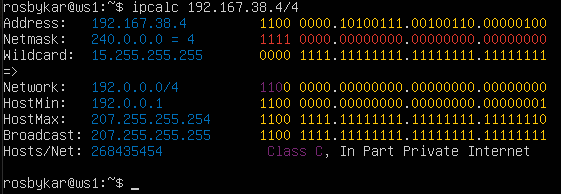
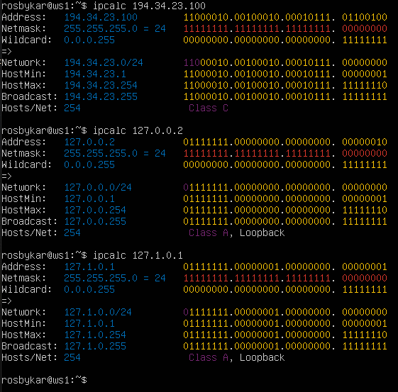
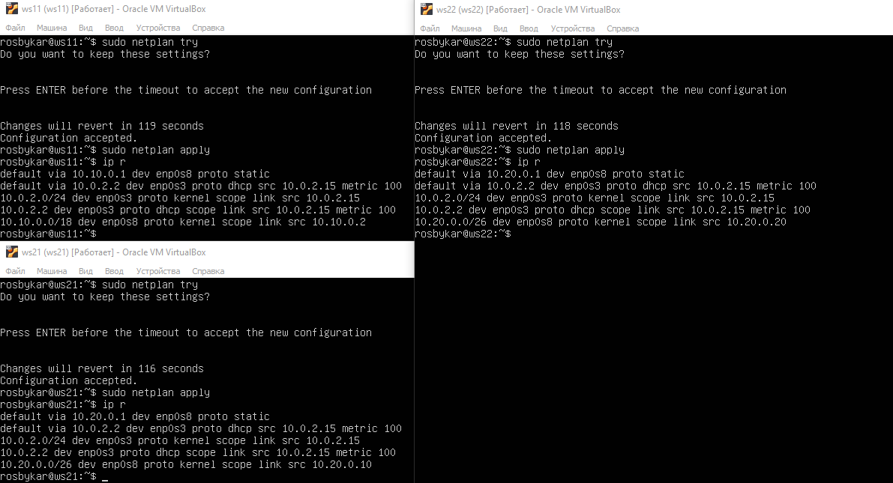

# Сети в Linux
Настройка сетей в Linux на виртуальных машинах.

## Part 1. Инструмент **ipcalc**
`
**== Задание ==**

##### Поднять виртуальную машину (далее -- ws1)

#### 1.1. Сети и маски
##### Определить и записать в отчёт:
##### 1) адрес сети *192.167.38.54/13* :

#### 192.160.0.0/13

### 2) перевод маски *255.255.255.0* в префиксную и двоичную запись:

#### /24 - префиксная
11111111.11111111.11111111.00000000 - двоичная

- */15* в обычную и двоичную:

#### 255.254.0.0 - обычная
11111111.11111110.00000000.00000000 - двоичная 
 
- *11111111.11111111.11111111.11110000* в обычную и префиксную:

255.255.255.240 - обычная
#### /28 - префиксная

### 3) минимальный и максимальный хост в сети *12.167.38.4* при масках: 

- */8*:

мин: 12.0.0.1

макс: 12.255.255.254

- *11111111.11111111.00000000.00000000*: 

мин: 12.167.0.1

макс: 12.167.255.254
 
- *255.255.254.0*:

мин: 12.167.38.1

макс: 12.167.39.254

- */4*:

мин: 0.0.0.1

макс: 15.255.255.254

### 1.2. localhost
#### localhost (так называемый, «местный» от англ. local, или «локальный хост», по смыслу — этот компьютер) — в компьютерных сетях, стандартное, официально зарезервированное доменное имя для частных IP-адресов (в диапазоне 127.0.0.1 — 127.255.255.254, RFC 2606). Для сети, состоящей только из одного компьютера, как правило, используется всего один адрес — 127.0.0.1, который устанавливается на специальный сетевой интерфейс «внутренней петли» (англ. loopback) в сетевом протоколе TCP/IP.

Loopback — это термин, который обычно используется для описания методов или процедур маршрутизации электронных сигналов, цифровых потоков данных, или других движущихся сущностей от их источника и обратно к тому же источнику без специальной обработки или модификаций. Первоначально он использовался для тестирования передачи или передающей инфраструктуры.

- Можно ли обратиться к приложению, работающему на localhost, со следующими IP:

*194.34.23.100* -нет

*127.0.0.2* -да 

*127.1.0.1* -да 

*128.0.0.1* -нет

### 1.3. Диапазоны и сегменты сетей
Публичным IP-адресом называется IP-адрес, под которым вас видят устройства в интернете, и он является уникальным во всей сети интернет. Доступ к устройству с публичным IP-адресом можно получить из любой точки глобальной сети.

Частный IP-адрес (англ. private IP address), также называемый внутренним, внутрисетевым или локальным — IP-адрес, принадлежащий к специальному диапазону, не используемому в сети Интернет. Такие адреса предназначены для применения в локальных сетях, распределение таких адресов никем не контролируется.

К приватным адресам относятся IP-адреса, значения которых лежат в следующих диапазонах: 
10.0.0.0 – 10.255.255.255 (10.0.0.0\8)
172.16.0.0 – 172.31.255.255 (172.16.0.0\12)
192.168.0.0 – 192.168.255.255 (192.168.0.0\16).
127.0.0.0 — 127.255.255.255 (Зарезервировано для петлевых интерфейсов (не используется для связи между узлами сети), так называемый localhost)

Все остальные IP относятся к публичным.

Приватные ip адресса: 10.0.0.45, 10.10.10.10, 172.20.250.4, 172.16.255.255, 192.168.4.2

Публичные ip адресса: 134.43.0.2, 172.0.2.1, 192.169.168.1, 172.68.0.2, 192.172.0.1

Шлюз (Gateway) – это сетевое устройство, предназначенное для объединения двух сетей (передачи между ними пользовательского трафика), которые обладают различными характеристиками, используют различные протоколы или технологии.

Возможные IP адреса шлюза у сети 10.10.0.0/18: 10.10.0.2, 10.10.10.10, 10.10.1.255

#### Определить и записать в отчёт:

К частным "серым" адресам относятся IP-адреса из следующих подсетей:

От 10.0.0.0 до 10.255.255.255 с маской 255.0.0.0 или /8

От 172.16.0.0 до 172.31.255.255 с маской 255.240.0.0 или /12

От 192.168.0.0 до 192.168.255.255 с маской 255.255.0.0 или /16

От 100.64.0.0 до 100.127.255.255 с маской подсети 255.192.0.0 или /10

#### 1) какие из перечисленных IP можно использовать в качестве публичного, а какие только в качестве частных:

 *10.0.0.45*- частный 

 *134.43.0.2*- публичный

 *192.168.4.2*- частный 

 *172.20.250.4*- частный 

 *172.0.2.1*- публичный

 *192.172.0.1*- публичный

 *172.68.0.2*- публичный

 *172.16.255.255*- частный

 *10.10.10.10*- частный

 *192.169.168.1*- публичный

### -  2) какие из перечисленных IP адресов шлюза возможны у сети *10.10.0.0/18*:
 
 *10.0.0.1*- нет
 
 *10.10.0.2*- да
 
 *10.10.10.10*- да
 
 *10.10.100.1*- нет
 
 *10.10.1.255*- да

## Part 2. Статическая маршрутизация между двумя машинами
В выводе команды ip a видим два стандартных интерфейса, lo (localhost) и enp0s3 (ethernet network peripheral #serial#).

В графическом интерфейсе Oracle VM в настройках каждой машины добавляем Адаптер 2 и выбираем опцию Внутренняя сеть, оставив имя и настройки сети по умолчанию. В выводе ip a появился новый интерфейс enp0s8. Меняем конфигурационный файл netplan на обеих машинах, описывая новый интерфейс.

Перезапускаем сервис сети.

### 2.1. Добавление статического маршрута вручную

Соединяем машины командами ip r add [адрес] dev [интерфейс]. Успешно пингуем.

### 2.2. Добавление статического маршрута с сохранением

Я прописал статический маршрут в конфигурационных файлах netplan на обеих машинах. Чтобы пункты to: и via: были в одной сети, я добавил каждой машине по статическому айпи в качестве шлюза. Успешно пингуем.

---
## Part 3. Утилита iperf3

### 3.1. Скорость соединения

- 8 Mbps = 1 MB/s
- 100 MB/s = 800000 Kbps
- 1 Gbps = 1000 Mbps

### 3.2. Утилита iperf3

Чтобы измерить скорость соединения, одной машине присвоим роль сервера командой iperf3 -s, а другой роль клиента командой iperf3 -c [адрес сервера]. Далее утилита сама проведет тестирование.

Результат - 4.79 Гигабит в секунду.

---
## Part 4. Сетевой экран

`-` После соединения машин, перед нами стоит следующая задача: контролировать информацию, проходящую по соединению. Для этого используются сетевые экраны.

**== Задание ==**

*В данном задании используются виртуальные машины ws1 и ws2 из Части 2*

#### 4.1. Утилита **iptables**
### 4.1. Утилита iptables

Содержимое файлов /etc/firewall.sh. Входящие пакеты от портов 22 и 80 по протоколу tcp разрешены. На ws1 подряд прописаны правила запрещающие и разрешающие echo-reply. На ws2 в разрешающем правиле прописан другой ключ (-I OUTPUT 1 вместо -A OUTPUT), который добавляет правило в начало цепи, вместо конца.

Сравниваем цепочки правил до и после выполнения скрипта. Видим, что на ws1 сначала идет запрещающее правило, а потом разрешающее. На ws2 наоборот.

Проверям пинг. ws1 не пингуется, ws2 пингуется.

### 4.2. Утилита nmap
Устанавливаем утилиту 'sudo apt install nmap'

С помощью утилиты nmap удостоверяемся, что оба хоста запущены.

Сохраняем дампы образов виртуальных машин.

## Part 5. Статическая маршрутизация сети

### 5.1. Настройка адресов машин

С помощью графического интерфейса VirtualBox создаем 5 новых машин и в настройках соединяем их внутренними сетями по данной схеме. Вносим соответствующие настройки в конфигурационные файлы netplan.

Перезапускаем службу сети и по выводу команды ip -4 a сверяем выставленные адреса со схемой. 

Пингуем ws11 с r1 и наоборот, также ws21 с ws22 и наоборот.

### 5.2. Включение переадресации IP-адресов

С помощью команды sysctl -w net.ipv4.ip_forward=1 включаем переадресацию ip-адресов.

Пробуем другой подход, который сохранится после перезагрузки. В файле /etc/sysctl.conf раскомментируем соответствующую строчку и сохраним файл.

Вывод команды ip r до добавления шлюза:

Изменения в конфигурационных файлах netplan. Добавляем маршрут до роутеров по умолчанию.

### 5.3. Установка маршрута по-умолчанию

Вывод команды ip r после добавления шлюза:

Результат пинга r2 с ws11. Командой tcpdump -tn -i enp0s8 перехватываем на r2 отправленные пакеты с ws11, прошедшие через r1.

### 5.4. Добавление статических маршрутов

Добавленные статические маршруты в конфигурационные файлы роутеров:

В выводе команды ip r видим, что теперь роутеры знают маршруты к каждой из локальных сетей.

Выводы команды ip r list на машине ws11:

Выводы отличаются, потому что в случае с маршрутом до сети 10.10.0.0/18 машине не нужно обращаться к роутеру, она и так находится в этой сети.

> 0.0.0.0/0 - это немаршрутизируемый адрес IPv4, который можно использовать в разных целях, в основном, в качестве адреса по умолчанию или адреса-заполнителя.

### 5.5. Построение списка маршрутизаторов

Отслеженный маршрут от ws11 до ws21 утилитой traceroute:

Вывод команды tcpdump -tnv -i enp0s8, относящийся к traceroute:

> Принцип работы traceroute:
>
>Утилита отправляет целевому узлу несколько пакетов с временем жизни 1 (TTL, time to live - число переходов, которые пакет может осуществить до своего исчезновения). Следующий маршрутизатор принимает пакеты и отправляет сообщение, что время жизни пакетов истекло. traceroute фиксирует адрес этого маршрутизатора и отправляет следующие пакеты, уже с TTL 2. Так, каждый раз увеличивая TTL на 1, traceroute составляет список маршрутизаторов, через которе прошли пакеты до целевого узла.

### 5.6. Использование протокола ICMP при маршрутизации

Пинг несуществующего айпи с ws11 и результат перехвата трафика на r1:

Сохраняем дампы образов виртуальных машин.

## Part 6. Динамическая настройка IP с помощью DHCP  
#### Для r2 настроить в файле /etc/dhcp/dhcpd.conf конфигурацию службы DHCP:  
#### 1) указать адрес маршрутизатора по-умолчанию, DNS-сервер и адрес внутренней сети.  
* вносим изменения в файл _/etc/dhcp/dhcpd.conf_  & в файле resolv.conf прописать nameserver 8.8.8.8. 

#### Перезагрузить службу DHCP командой systemctl restart isc-dhcp-server. Машину ws21 перезагрузить при помощи reboot и через ip a показать, что она получила адрес. Также пропинговать ws22 с ws21.  
* перезагружаем службу DHCP  
* Перезагружаем ws21 с помощью команды `sudo reboot` и вызываем команду `ip a`
* пингуем ws22 с ws21

#### Указать MAC адрес у ws11, для этого в etc/netplan/00-installer-config.yaml надо добавить строки: macaddress: 10:10:10:10:10:BA, dhcp4: true  
* вносим изменения в в _/etc/netplan/00-installer-config.yaml_  

#### Для r1 настроить аналогично r2, но сделать выдачу адресов с жесткой привязкой к MAC-адресу (ws11). Провести аналогичные тесты  
* Снова скачиваем isc-dhcp-server и вносим изменения в файл _/etc/dhcp/dhcpd.conf_  затем редактируем файл _/etc/resolv.conf_  

* перезагружаем службу DHCP  &  перезагружаем ws11 и вызываем `ip a` 
  

* пингуем ws22  

#### Запросить с ws21 обновление ip адреса  
* `ip a` на ws21 до обновления  

* вызываем команду `sudo dhclient enp0s8 -r`, потом `sudo dhclient enp0s8` и снова `ip a`  

* в данном пункте пользовался опцией -r для того, чтобы очистить список ip адресов.  

Сохраняем дампы образов виртуальных машин.

## Part 7. **NAT**
Установил apache2 на r1 и ws22, затем отключил для виртуальных машин адаптер NAT.

Измененные ports.conf и запуск серверов Apache:

На следующих двух скринах содержимое скрипта для изменения фаервола на r2.

Сначала прописываем общую политику отбрасывать все маршрутизируемые пакеты, затем добавляем разрешение icmp-пакетов для прохода пинга. Без разрешения (на первом скрине) ws22 не пингуется r1, с разрешением (на втором скрине) пингуется.

Для следующей части задания я разрешил проходить tcp-пакетам через r2 и добавил к настройкам apache2 на ws22 прослушивание 8080 порта. Прописанные для SNAT и DNAT строчки в скрипте представлены на скрине. r1 подключается к ws22 и наоборот.

Сохраняем дампы образов виртуальных машин.

## Part 8. Дополнительно. Знакомство с SSH Tunnels  
#### Запустить на r2 фаервол с правилами из Части 7  
* смотрим правила фаервола  и запускаем его 
  

#### Запустить веб-сервер Apache на ws22 только на localhost (то есть в файле _/etc/apache2/ports.conf_ изменить строку `Listen 80` на `Listen localhost:80`)  
* вносим изменения в файл  
  

Запустим веб-сервер Apache на ws22 только на `localhost` (то есть в файле `/etc/apache2/ports.conf` изменим строку `Listen 80` на `Listen localhost:80`)

Переадресация локального порта позволяет перенаправить порт на локальном компьютере (клиент ssh) на порт на удаленном компьютере (сервер ssh), который затем перенаправляется на порт на компьютере назначения. В этом типе переадресации клиент SSH прослушивает заданный порт и туннелирует любое подключение к этому порту к указанному порту на удаленном сервере SSH, который затем подключается к порту на целевом компьютере. Конечным компьютером может быть удаленный SSH-сервер или любой другой компьютер.

Устанавливаем соединение с сервером ws22 от машины ws21

`ssh -L 8080:localhost:80 10.20.0.20`

Воспользуемся `Remote TCP forwarding` c ws11 до ws22, чтобы получить доступ к веб-серверу на ws22 с ws11

Переадресация удаленного порта противоположна переадресации локального порта. Это позволяет перенаправить порт на удалённом компьютере (сервер ssh) на порт на локальном компьютере (клиент ssh), который затем перенаправляется на порт на компьютере назначения. В этом типе переадресации сервер SSH прослушивает заданный порт и туннелирует любое соединение с этим портом на указанный порт локального клиента SSH, который затем подключается к порту на целевом компьютере. Машина назначения может быть локальной или любой другой машиной. Удаленное перенаправление портов в основном используется для предоставления доступа к внутренней службе кому-то извне.

Для проверки, сработало ли подключение в обоих предыдущих пунктах, перейдите во второй терминал (например, клавишами Alt + F2) и выполните команду:
`telnet 127.0.0.1 [локальный порт]`

ws11:

ws21:

Сохраняем дампы образов виртуальных машин.

# Сети в Linux
Настройка сетей в Linux на виртуальных машинах.

